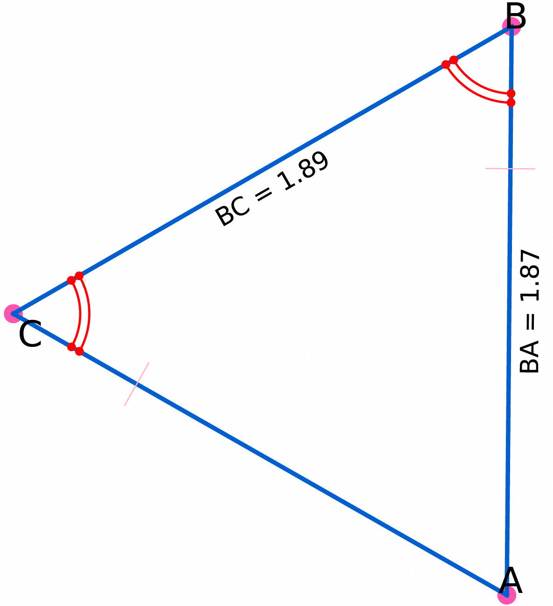
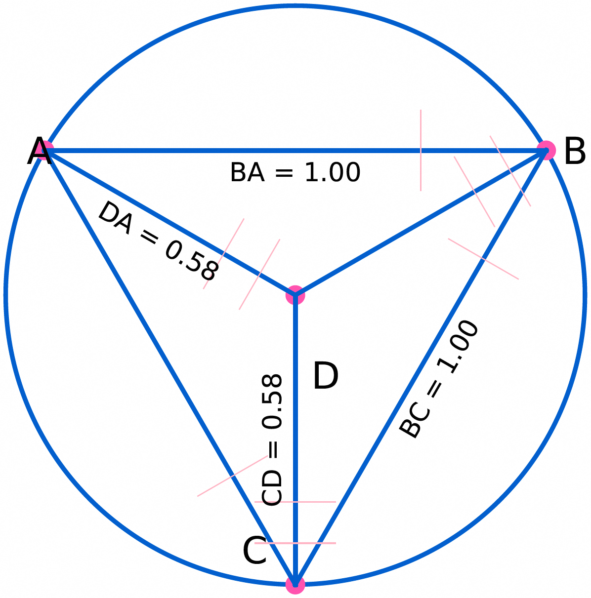
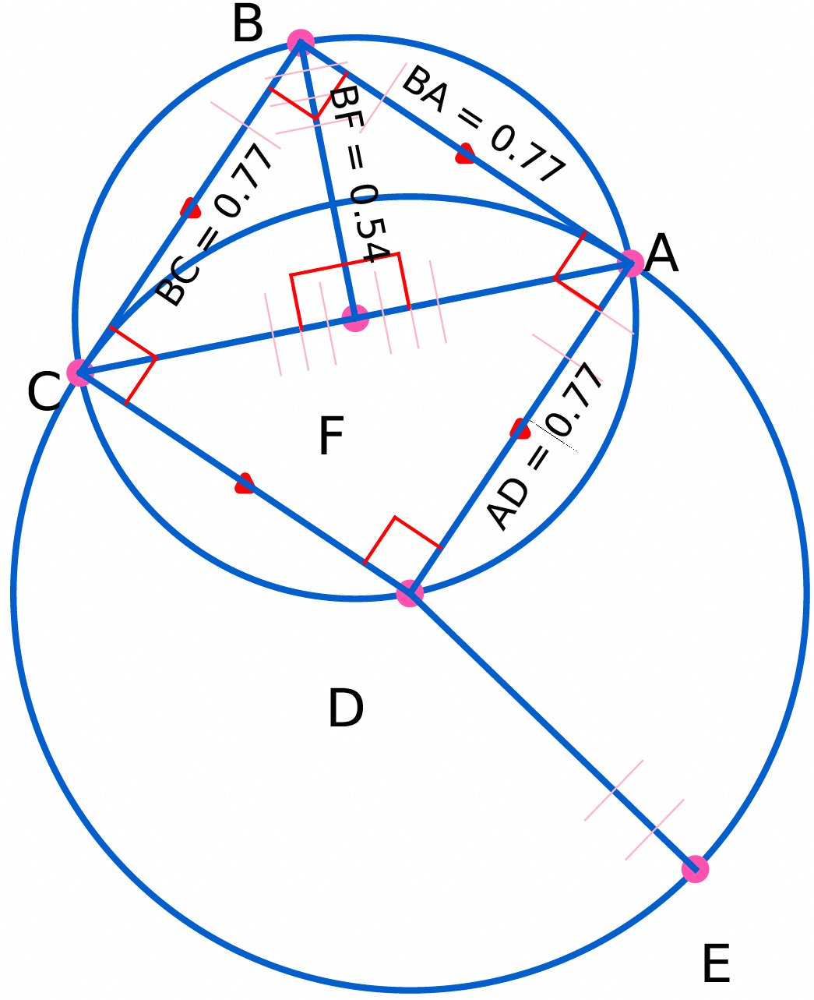
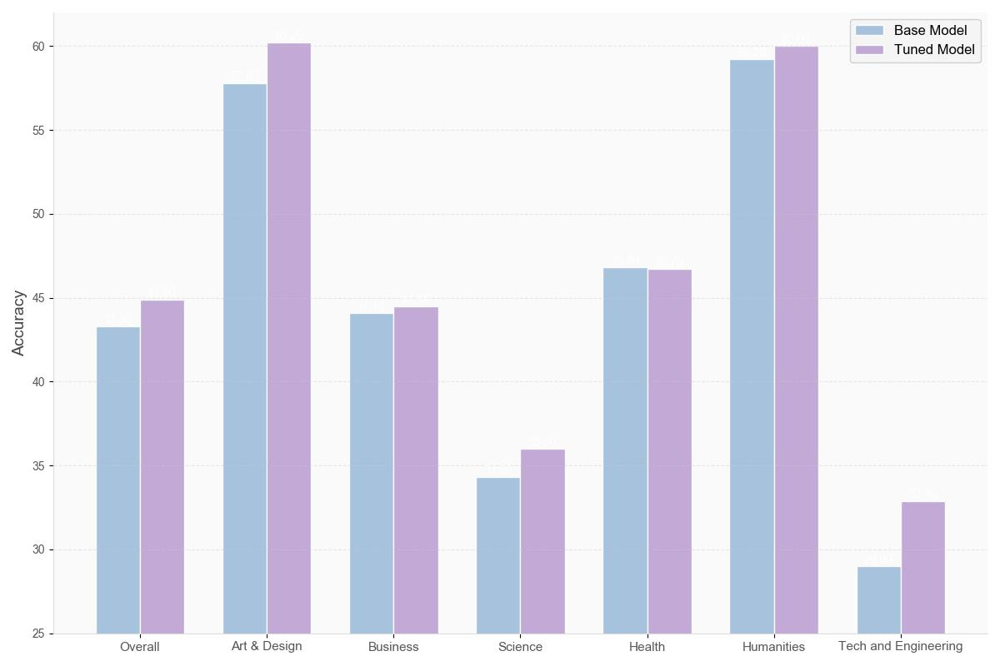
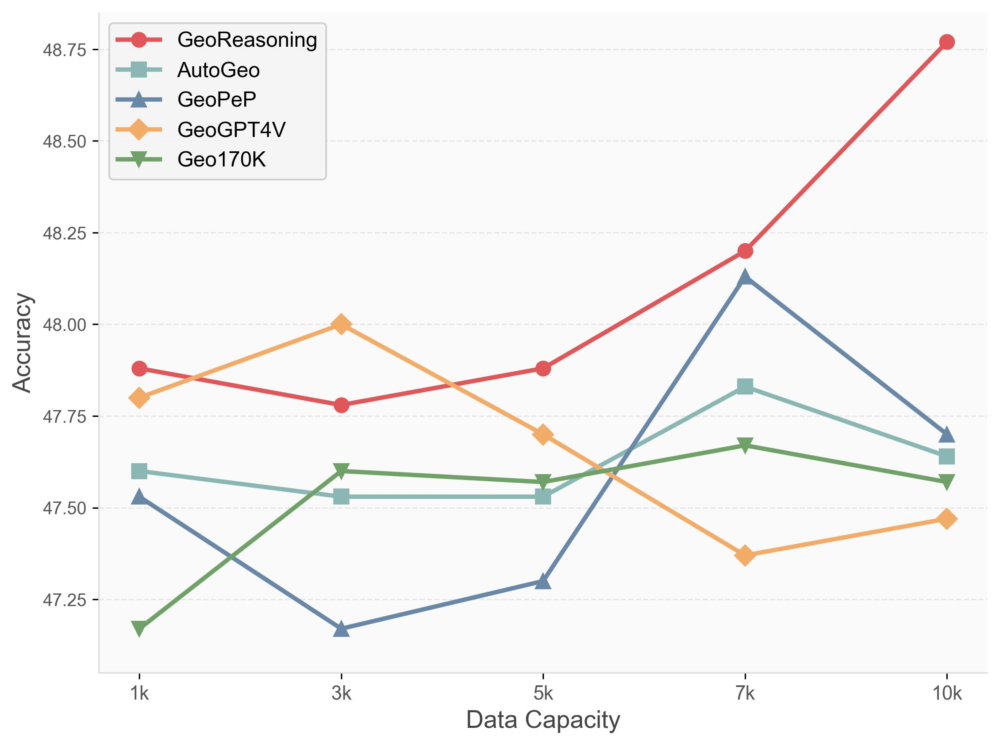
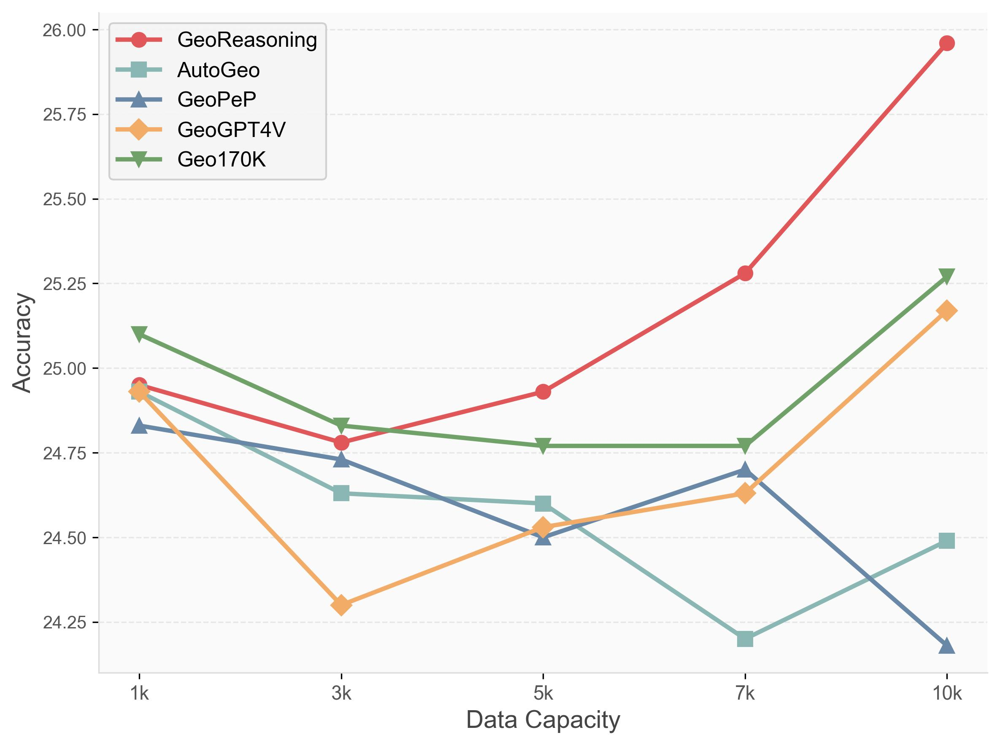

# GeoReasoning: Generalizable Geometric Image Caption Synthesis
<link rel="stylesheet" href="./static/css/bulma.min.css">
<link rel="stylesheet" href="./static/css/bulma-carousel.min.css">
<link rel="stylesheet" href="./static/css/bulma-slider.min.css">
<link rel="stylesheet" href="./static/css/fontawesome.all.min.css">
<link rel="stylesheet" href="https://cdn.jsdelivr.net/gh/jpswalsh/academicons@1/css/academicons.min.css">
<link rel="stylesheet" href="./static/css/index.css">

<p align="center">
  📑 <a href="https://machinephoenix.github.io/GeoReasoning_blog/">Blog</a> &nbsp&nbsp
  📑 <a href="https://arxiv.org/abs/2509.15217">Paper</a> &nbsp&nbsp
  🤗 <a href="https://huggingface.co/datasets/ScaleMath/GeoReasoning">Hugging Face</a>
</p>

# Introduction

* 📊 GeoReasoning delivers high-quality image-caption pairs that outperform all counterparts on downstream benchmarks with superior scaling.
* 🌐 Achieves significant gains beyond geometry - boosting performance in non-geometric math tasks (2.8-4.8%) and non-mathematical domains like art & engineering (2.4-3.9%).
* ⚡ Built from 50 basic relations, enabling unlimited complexity expansion for diverse geometry problems.

<div align="center">
  
  
  
</div>


<div align="center">
  
</div>
<div align="center">
  
  
</div>


This repository contains the official implementation for the GeoReasoning dataset and training framework, which significantly enhances multimodal reasoning capabilities in AI systems, particularly for geometric problem solving.

# Data Generation

To be continued soon.

# RLVR
Our implementation is built upon [LLaMA-Factory](https://github.com/hiyouga/LLaMA-Factory), a very strong codebase for fine-tuning and RL.

## Quick Start
We borrow from the quick start of LLaMA-Factory.
### Installation

> [!IMPORTANT]
> Installation is mandatory.

#### Install from Source

```bash
git clone --depth 1 https://github.com/hiyouga/LLaMA-Factory.git
cd LLaMA-Factory
pip install -e ".[torch,metrics]" --no-build-isolation
```

Extra dependencies available: torch, torch-npu, metrics, deepspeed, liger-kernel, bitsandbytes, hqq, eetq, gptq, aqlm, vllm, sglang, galore, apollo, badam, adam-mini, qwen, minicpm_v, openmind, swanlab, dev

#### Install from Docker Image

```bash
docker run -it --rm --gpus=all --ipc=host hiyouga/llamafactory:latest
```

This image is built on Ubuntu 22.04 (x86\_64), CUDA 12.4, Python 3.11, PyTorch 2.6.0, and Flash-attn 2.7.4.

Find the pre-built images: https://hub.docker.com/r/hiyouga/llamafactory/tags

Please refer to [build docker](#build-docker) to build the image yourself.

<details><summary>Setting up a virtual environment with <b>uv</b></summary>

Create an isolated Python environment with [uv](https://github.com/astral-sh/uv):

```bash
uv sync --extra torch --extra metrics --prerelease=allow
```

Run LLaMA-Factory in the isolated environment:

```bash
uv run --prerelease=allow llamafactory-cli train examples/train_lora/llama3_lora_pretrain.yaml
```

</details>

<details><summary>For Windows users</summary>

<details>
<summary>Example Code (you can run it in ./data/demo.py)</summary>

```Python
import sys
import os
from utils.loading_utils import load_definitions_and_rules
import graph as gh
import problem as pr
from clause_generation import * #CompoundClauseGen
import signal
from pretty_problem_statement_dict import * # 改为经过语料扩展的结果
import json
from data_augmentation.opencv import *
import shutil
sys.path.append('..')
signal.signal(signal.SIGALRM, signal_handler)
data_desc=[]

save_dir='./demo'
defs_path = './defs.txt'
rules_path = './rules.txt'
complexity = 1 # set complexity

cc_gen = CompoundClauseGen(definitions, complexity)

# Automatic clause select
txt = cc_gen.generate_clauses()
# Manual clause select
# txt = "A B C = triangle A B C"

p = pr.Problem.from_txt(txt)

# Load definitions and rules
definitions, rules = load_definitions_and_rules(defs_path, rules_path)

try:
    # Set an alarm for 5 seconds
    signal.alarm(5)
    # Code block to execute with timeout
    g, _ = gh.Graph.build_problem(p, definitions)

    # Additionaly draw this generated problem
    gh.nm.draw_reinforce(
        g.type2nodes[gh.Point],
        g.type2nodes[gh.Line],
        g.type2nodes[gh.Circle],
        g.type2nodes[gh.Segment],
        theme='',
        save_to=save_dir+f"/img/demo.jpg")

    data_desc.append(
        {
        "id": f"demo",
        "image": f"img/demo.jpg",
        "conversations": [
            {
                "from": "human",
                "value": "Render a clear and concise description of a image about geometric shapes.\n<image>"
            },
            {
                "from": "gpt",
                "value": gen_nl(txt)
            }
        ],
        "clause": [remove_uppercase_space(clause_item) for clause_item in txt.split(";")]
    }
    )
        
    signal.alarm(0)
except KeyboardInterrupt:
    sys.exit(0)
except:
    print('err occurred, retrying ...')
    sys.exit(0)

json_data = json.dumps(data_desc, indent=2)
with open(f"{save_dir}/data.json", "w") as file:
    file.write(json_data)

```
</details>

## Data Synthesis Examples

### Examples


### Briefs about AutoGeo-100k


## Model Geometry Caption
After you generate data, you can pretrain model on the synthesized geometry captioning data by runing the following script:
```
./scripts/v1_5/gc.sh
```
This script will tune the model and then evaluate the performance.

1. Hyperparameter of Captioning Pretraining

| Hyperparameter | Global Batch Size | Learning rate | Epochs | Max length | Weight decay |
| --- | ---: | ---: | ---: | ---: | ---: |
| LLaVA-v1.5-7B | 64*8 | 6e-5 | 2 | 512 | 0 |

2. Model Parameter Setting of Captioning Pretraining

| Model Parameter Setting| ViT | Projector | Language Module |
| --- | ---: | ---: | ---: |
| LLaVA-v1.5-7B | Lora with lora r = 128 and lora alpha = 256 | Tunable | Frozen |
<!-- | --- | ---: | ---: |
| LLaVA-v1.5-13B | Lora with lora r = 128 and lora alpha = 256 | Tunable | Frozen |
| --- | ---: | ---: |
| MiniGPT4 | Lora with lora r = 64 and lora alpha = 16 | Tunable | Frozen | -->


## Model Geometry Questioning and Answering
After you tuned model on the synthesized data, you can further tune the model on QA data by runing:
```
./scripts/v1_5/gqa.sh
```

1. Hyperparameter of Geometry Q&A Tuning

| Hyperparameter | Global Batch Size | Learning rate | Epochs | Max length | Weight decay |
| --- | ---: | ---: | ---: | ---: | ---: |
| LLaVA-v1.5-7B(Caption Tuned) | 64*4 | 6e-5 | 3 | 512 | 0 |
| LLaVA-v1.5-13B(Caption Tuned) | 24*4 | 6e-5 | 1 | 512 | 0 |

2. Model Parameter Setting of Geometry Q&A Tuning

| Model Parameter Setting| ViT | Projector | Language Module |
| --- | ---: | ---: | ---: |
| LLaVA-v1.5-7B | Frozen | Tunable | Lora with lora r = 256 and lora alpha = 512 |
| LLaVA-v1.5-13B | Frozen | Tunable | Lora with lora r = 256 and lora alpha = 512 |
