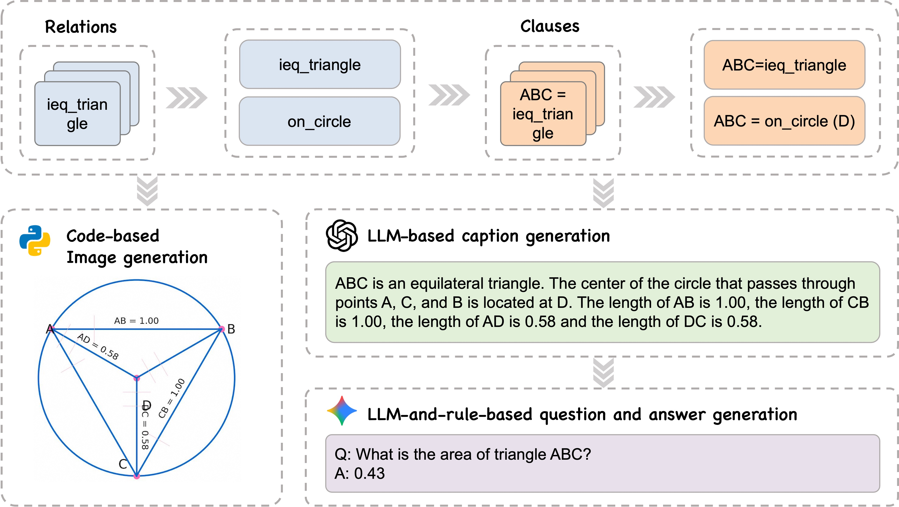
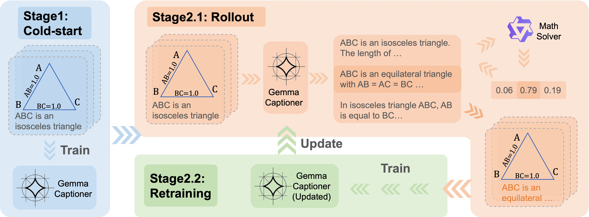
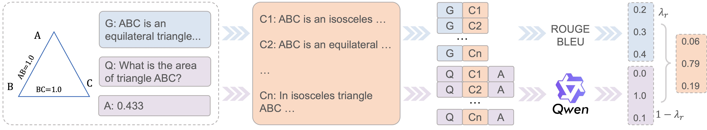

# GeoReasoning: Generalizable Geometric Image Caption Synthesis
<link rel="stylesheet" href="./static/css/bulma.min.css">
<link rel="stylesheet" href="./static/css/bulma-carousel.min.css">
<link rel="stylesheet" href="./static/css/bulma-slider.min.css">
<link rel="stylesheet" href="./static/css/fontawesome.all.min.css">
<link rel="stylesheet" href="https://cdn.jsdelivr.net/gh/jpswalsh/academicons@1/css/academicons.min.css">
<link rel="stylesheet" href="./static/css/index.css">

<p align="center">
  📑 <a href="https://machinephoenix.github.io/GeoReasoning_blog/">Blog</a> &nbsp&nbsp
  📑 <a href="https://arxiv.org/abs/2509.15217">Paper</a> &nbsp&nbsp
  🤗 <a href="https://huggingface.co/datasets/ScaleMath/GeoReasoning">Hugging Face</a>
</p>

# Introduction

* 📊 GeoReasoning delivers high-quality image-caption pairs that outperform all counterparts on downstream benchmarks with superior scaling.
* 🌐 Achieves significant gains beyond geometry - boosting performance in non-geometric math tasks (2.8-4.8%) and non-mathematical domains like art & engineering (2.4-3.9%).
* ⚡ Built from 50 basic relations, enabling unlimited complexity expansion for diverse geometry problems.


<div align="center">
  
</div>
<div align="center">
  
  
</div>


This repository contains the official implementation for the GeoReasoning dataset and training framework, which significantly enhances multimodal reasoning capabilities in AI systems, particularly for geometric problem solving.

# Data Generation
The data generation pipeline is shown below:
<div align="center">
  
</div>

Some generated samples are exhibited here:
<div align="center">
  
  
  
</div>

The code will be released very soon.

# RLVR
The training pipeline is:
<div align="center">
  
</div>
where the reward modeling is shown below:
<div align="center">
  
</div>


Our implementation is built upon [LLaMA-Factory](https://github.com/hiyouga/LLaMA-Factory), a very strong codebase for fine-tuning and RL.


## Installation
We adopt the installation of LLaMA-Factory.

> [!IMPORTANT]
> Installation is mandatory.

<details><summary>Install from Source</summary>

```bash
git clone --depth 1 https://github.com/hiyouga/LLaMA-Factory.git
cd LLaMA-Factory
pip install -e ".[torch,metrics]" --no-build-isolation
```

Extra dependencies available: torch, torch-npu, metrics, deepspeed, liger-kernel, bitsandbytes, hqq, eetq, gptq, aqlm, vllm, sglang, galore, apollo, badam, adam-mini, qwen, minicpm_v, openmind, swanlab, dev
</details>

<details><summary>Install from Docker Image</summary>
```bash
docker run -it --rm --gpus=all --ipc=host hiyouga/llamafactory:latest
```

This image is built on Ubuntu 22.04 (x86\_64), CUDA 12.4, Python 3.11, PyTorch 2.6.0, and Flash-attn 2.7.4.

Find the pre-built images: https://hub.docker.com/r/hiyouga/llamafactory/tags

Please refer to [build docker](#build-docker) to build the image yourself.
</details>


<details><summary>Setting up a virtual environment with <b>uv</b></summary>

Create an isolated Python environment with [uv](https://github.com/astral-sh/uv):

```bash
uv sync --extra torch --extra metrics --prerelease=allow
```

Run LLaMA-Factory in the isolated environment:

```bash
uv run --prerelease=allow llamafactory-cli train examples/train_lora/llama3_lora_pretrain.yaml
```

</details>


## QuickStart
Gemma3-Infer contains all necessary codes for SFT and VLLM inference.

```
└── Gemma3-Infer
    ├── scripts_raft
    │   └── run_raft_*.sh
    ├── scripts_eval
    │   ├── eval_mathvista_*.sh
    |   └── eval_mathverse_*.sh
    ├── src_raft
    │   ├── caption_generation_llamafactory_ray.py
    |   └── caption_reward.py
    └── src_eval
        └── reasoning_rewarding_ray.py
```

### scripts_raft & src_raft
"scripts_raft" folder contains some shell scripts related to the RAFT process under different settings, and you can refer to the .py files. These files are mainly in the "src_raft" folder. But some of them (for example, 'caption_generation_llamafactory_ray.py') are called under the path "LLaMA-Factory/scripts", although we also copy them into the "src_raft" folder.

### scripts_eval & src_eval
"scripts_eval" folder contains some shell scripts related to evaluation on downstream benchmarks (MathVista and MathVerse), and you can refer to the called .py files (mainly in the "src_eval" folder).

# Performance
  <section class="case-section">
    <style>
      .case-section {
        padding: 4rem 2rem;
        background: #f8f9fa;
        font-family: -apple-system, BlinkMacSystemFont, 'Segoe UI', Roboto, sans-serif;
        color: #333;
        line-height: 1.6;
      }

      .case-container {
        max-width: 1000px;
        margin: 0 auto;
      }
    </style>

    <div class="case-container">
      <!-- <h2 class="section-title">Case Study</h2>
        <div class="description">
            <p>Here are some randomly selected samples from MathVista.</p>
        </div>
        <div class="container">
            <div id="results-carousel" class="carousel results-carousel" style="margin-top: -32rem;">
              <div class="item is-flex is-justify-content-center" >
                 
                <h2 class="subtitle has-text-centered">
                </h2>
              </div>
              <div class="item is-flex is-justify-content-center">
                
                <h2 class="subtitle has-text-centered">
                </h2>
              </div>
              <div class="item is-flex is-justify-content-center">
                
                <h2 class="subtitle has-text-centered">
               </h2>
              </div>
              <div class="item is-flex is-justify-content-center">
                
                <h2 class="subtitle has-text-centered">
               </h2>
             </div>
            </div>
          </div> -->
        <!-- <div class="description">
        <p></p>
        </div> -->
        <!-- <div class="figures-container" style="display: grid; grid-template-columns: repeat(2, 1fr); gap: 1rem; justify-items: center;">
            <div class="figure-wrapper" style="text-align: center;">
              
              <div class="figure-caption">
              </div>
              A geometric case
            </div>
            <div class="figure-wrapper" style="text-align: center;">
              
              <div class="figure-caption">
              </div>
              An arithmetic case
            </div>
            <div class="figure-wrapper" style="text-align: center;">
              
              <div class="figure-caption">
              </div>
              An algebraic case
            </div>
            <div class="figure-wrapper" style="text-align: center;">
              
              <div class="figure-caption">
              </div>
              A numeric case
            </div>  
          </div> -->
          <!-- <div class="description">
            <p></p>
          </div> -->
    <!-- </div> -->

    <h2 class="section-title">Case Study</h2>
    <h3 class="subsection-title">MathVista</h3>
      <div class="description">
          <p>Here are some samples on geometry, arithmetic, numeric, and scientific domains from MathVista.</p>
      </div>
    <div class="columns is-centered m-6">
        <div class="column is-full has-text-centered content">
          
          <div id="results-carousel" class="carousel results-carousel">
            <div class="box m-5">
              <div class="content has-text-centered">
                
              </div>
            </div>
            <div class="box m-5">
              <div class="content has-text-centered">
                
              </div>
            </div>
            <div class="box m-5">
              <div class="content has-text-centered">
                
              </div>
            </div>
            <div class="box m-5">
              <div class="content has-text-centered">
                
              </div>
            </div>
            
          </div>
        </div>
      </div>
      <div class="description">
        <p>These cases demonstrate that the geometry captioning task boosts the arithematic reasoning and geometric understanding capacity of base models.</p>
    </div>
      
      <h3 class="subsection-title">MMMU</h3>
      <div class="description">
        <p>Here are some samples on engineering, physics, and economics domains from MMMU.</p>
    </div>
  <div class="columns is-centered m-6">
      <div class="column is-full has-text-centered content">
        
        <div id="results-carousel" class="carousel results-carousel">
          <div class="box m-5">
            <div class="content has-text-centered">
              
            </div>
          </div>
          <div class="box m-5">
            <div class="content has-text-centered">
              
            </div>
          </div>
          <div class="box m-5">
            <div class="content has-text-centered">
              
            </div>
          </div>
          
        </div>
      </div>
    </div>
    <div class="description">
      <p>These cases indicate that the model trained on GeoReasoning is more detailed and accurate in observing shape and develops superior spatial reasoning and line-art reasoning ability.</p>
  </div>


    </div>
</section>


## Citation
```
@misc{georeasoning,
      title={Generalizable Geometric Image Caption Synthesis}, 
      author={Yue Xin and Wenyuan Wang and Rui Pan and Ruida Wang and Howard Meng and Shizhe Diao and Renjie Pi and Tong Zhang},
      year={2025},
      eprint={2509.15217},
      archivePrefix={arXiv},
      primaryClass={cs.AI; cs.CV; cs.LG},
      url={https://arxiv.org/abs/2509.15217}, 
  }
```

## Acknowledgement

This repo benefits from [LLaMA-Factory](https://github.com/hiyouga/LLaMA-Factory), [VLLM](https://github.com/vllm-project/vllm), [AlphaGeometry](https://github.com/google-deepmind/alphageometry), and [AutoGeo](https://github.com/AutoGeo-Official/AutoGeo). Thanks for their wonderful works.

